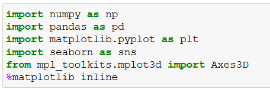
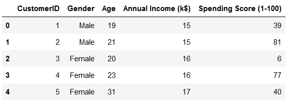
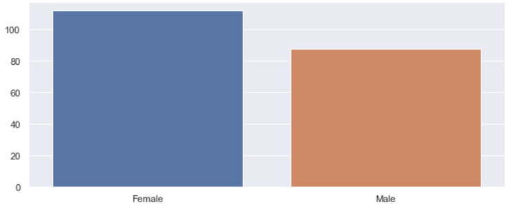
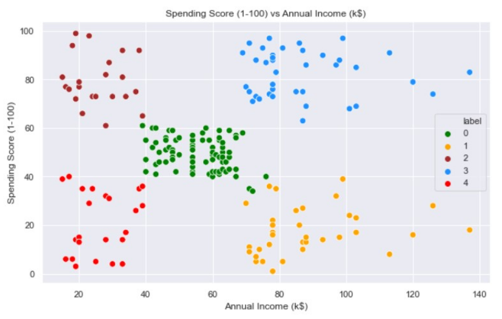
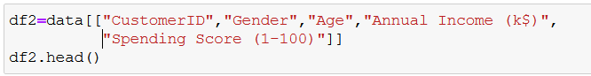
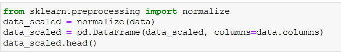
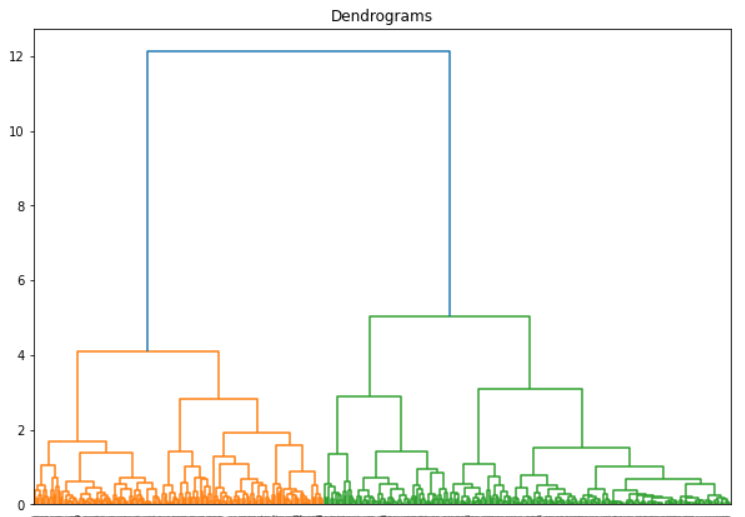

**Lab 3: Unsupervised Learning (Clustering)**

#### Pre-reqs:
- Google Chrome (Recommended)

#### Lab Environment
Notebooks are ready to run. All packages have been installed. There is no requirement for any setup.

All examples are present in `~/work/machine-learning-essentials-module2/lab_3` folder. 

**K-Means Clustering**

K-Means is a clustering approach in which the data is grouped into K distinct non-overlapping clusters based on their distances from the K centers. The value of K needs to be specified first and then the algorithm assigns the points to exactly one cluster.

**Exercise** 

Importing all the required libraries

Consider a collection of points that are sampled from three different densities, in this case, normal densities with the same covariances but different means.

Here is a scatterplot of this data. We clearly see three mixture components. 

You can perform clustering either at the class level or across all samples and then label each cluster with its corresponding class label.

Obviously, those centres are wrong, but let’s keep going.

Now, we compute the assignment of the data points to the prototypes (array Closet). This is also wrong, but we’re going to be using it anyway.

Now we pretend that the cluster assignments are correct and recompute the location of the centres.

As we can see, the centres have moved, and it looks like they have generally moved in the right direction.

Now, let’s just repeat this process multiple times

We can now plot the path that the prototype guesses have taken.

As you can see, the final location of the prototype centres (red) is nicely in the centre of the classes. The algorithm doesn’t give us exactly the cluster centres because there are three clusters, but we postulated four cluster centres.

We can also look at the partition of the data included by these cluster centres.

The diagram above shows the step-by-step implementation of the K-Means algorithm.

As we saw earlier, we need to provide the value of K before ahead. But the question is how to get a good value of K. An optimum value of k is obtained using the Elbow Method.

**Case Study**

**Mall Customer Data**

Mall customer data is an interesting dataset that has hypothetical customer data. It puts you in the shoes of the owner of a supermarket. You have customer data, and on this basis of the data, we must divide the customers into various groups.

` `**Importing the necessary libraries**

We have imported the necessary libraries. Let’s go ahead and import the data.

Let’s do some basic data exploration.

We have a total of 200 observations and 5 features.

All the features are imported with correct data types and there are no null values in the dataset.

Let’s check the correlation between the numeric values.

The data seems to be interesting as there is no correlation between the variables.

**Visualizing the Distributions**

**Annual Income Distribution**

Most of the customer’s income falling between $50K to $80K. a small number of customers having an income greater than $80K.

**Age Distribution**

There are customers of a wide variety of ages.

**Spending Score Distribution**

The maximum spending score is in the range of 40 to 60.

**Gender Analysis:**

Most of the customers are female customers than males.

**Clustering based on 2 features**

First, we work with two features only, annual income and spending score.

We subset the dataset with only two features (Annual Income, Spending Score) and saved it to the variable “X”.

Let’s check the correction between two variables using a scatter plot.

Now we calculate Within Cluster Sum of Squared Errors (WCSSE) for different values of k. Next, we choose the k for which WCSSE first starts to diminish. This value of K gives us the best number of clusters to make from the raw data.

This is known as the elbow graph, the x-axis being the number of clusters, the number of clusters is taken at the elbow joint point. This point is the point where making clusters is most relevant as here the value of WCSSE suddenly stops decreasing. Here in the graph, after 5 the drop is minimal, so we take 5 to be the number of clusters.

The labels added to the data.

We can clearly see that 5 different clusters have been formed from the data. The red cluster is the customers with the least income and least spending score, similarly, the blue cluster is the customers with the most income and most spending score.

Now let’s print the customer ID according to the groups

**K-Means Clustering based on 3D data**

Now, we shall be working on 3 types of data. Apart from the spending score and annual income of customers, we shall also take in the age of the customers.

Filtering the features 

Now we calculate the WCSSE for different values of k.

Assigning cluster labels to the clusters.

Plotting 3D plot as we did the clustering based on 3 input features.

**Hierarchical Clustering**

Importing the necessary libraries

Now let’s define a method to plot the clusters.

A simple clustering problem

The idea behind linkage clustering or hierarchical clustering is to put things that are close together into the same cluster. Linkage clustering is usually based on distances only.

Compute the distance between each pair of the two collections of inputs i.e., calculate distance between all the points in data.

Based on pairwise distances, we can now compute a linkage matrix. We successively merge the closest points/clusters into the same cluster. The linkage “matrix” is simply a table listing which pairs of points are merged at what step and what distance.

We can “cut” the dendrogram to form a flat cluster. If we cut the above diagram into two clusters, we get a good answer.

Plotting the individual clusters

As you can see that now the clusters are shown in two different colors. It means that the algorithm has created two separate groupings based on some similarity criteria.

In the lines above, have talked about the linkage matrices and we have written in our code “lm = linkage (ds, “single”)”. So let’s discuss the different types of linkages that we generally use.

**Linkage Methods**

Taking data for example

Initially, hierarchical clustering starts out with clusters consisting of individual points. Later, it compares clusters with each other and merges the two “closest” clusters.

Since clusters are a set of points, there are many kinds of linkage methods:

- **Single Linkage:** Minimal intercluster dissimilarity. Compute all pairwise dissimilarities between the observations in cluster A and the observations in cluster B, and record the smallest of these dissimilarities. Single linkage can result in extended, trailing clusters in which single observations are fused one at a time.

- Cluster distance is the smallest distance between any point in cluster1 and any point in cluster 2.
- Highly sensitive to outliers when forming flat clusters.
- Works well for low-noise data with an unusual structure.

- **Complete Linkage:** Maximal Intercluster dissimilarity. Compute all pairwise dissimilarities between the observations in cluster A and the observations in cluster B and record the largest of these dissimilarities.
  - Cluster distance is the largest distance between any point in cluster1 and any point in cluster 2
  - Less sensitive to outliers than single linkage.

- **Average Linkage:** Mean intercluster dissimilarity. Compute all pairwise dissimilarities between the observation in cluster A and the observation in cluster B, and record the average of these dissimilarities.
  - Cluster distance is the average distance of all pairs of points in clusters 1 and 2

- **Centroid Linkage:** The dissimilarity between the centroid for cluster A (a mean vector of length p) and the centroid for cluster B. Centroid linage can result in undesirable inversions.
  - Cluster distance is the distance of the centroids of both clusters

- **Ward Linge:** Wikipedia says Ward’s minimum variance criterion minimizes the total within-cluster variance. To implement this method, at each step find the pair of clusters that leads to a minimum increase in total within-cluster variance after merging.
  - Based on minimizing a variance criterion before and after merging.

**Case Study**

We will be working on a wholesale customer segmentation problem. The data is hosted on the UCI Machine Learning repository. The aim of this problem is to segment the Client of a wholesale distributor based on their annual spending on diverse product categories like milk, grocery, region, etc.

**Importing all the necessary libraries**

**Load the data and look at the first few rows.**

There are multiple product categories – Fresh, Milk, Grocery, etc. The values represent the number of units purchased by each client for each product. **Our aim is to make clusters from this data that can segment similar clients together.** We will, of course, use Hierarchical Clustering for this problem.

But before applying Hierarchical Clustering, we must normalize the data so that the scale of each variable is the same. Why is this important? Well, if the scale of the variables is not the same, the model might be biased towards the variables with a higher magnitude like Fresh or Milk (refer to the above table).

So, let’s first normalize the data and bring all the variables to the same scale:

Here, we can see that the scale of all the variables is almost similar. Now, we are good to go. Let’s first draw the dendrogram to help us decide the number of clusters for this problem:

The x-axis contains the samples and the y-axis represents the distance between these samples. The vertical line with maximum distance is the blue line and hence we can decide on a threshold of 6 and cut the dendrogram.

We have two clusters as this line cuts the dendrogram at two points. Let’s now apply hierarchical clustering for 2 clusters:

We can see the values of 0s and 1s in the output since we defined 2 clusters. 0 represents the points that belong to the first cluster and 1 represents points in the sending cluster.

Let’s now visualize the two clusters:

Awesome! We can clearly visualize the two clusters here. This is how we can implement hierarchical clustering in Python.

**Principal Component Analysis**

Principal components are the derived features that explain the maximum variance in the data. The first principal component explains the most variance, the second a bit less, and so on. Each of the new dimensions found using PCA is a linear combination of the old features.

**Case Study**

This dataset has 19 columns (or dimensions) we will try to reduce its dimension using PCA. 

**Importing all the necessary libraries**

**Importing data and exploring the top five observations**

Let’s check the statistical summary of our dataset to find the scale of different attributes.

Above we can see that every attribute is on a different scale. Therefore, we can not jump to PCA directly without changing the scales of attributes.

We see that column “Post Weekday” has less variance and column “Lifetime Post Total Reach” has comparatively more variance.

Therefore, if we apply PCA without standardization of data then more weightage will be given to the “Lifetime Post Total Reach” column during the calculation of “eigenvectors” and “eigenvalues” and we will get biased principal components.

Now we will standardize the dataset using “RobustScaler” of the “sklearn” library. Other ways of standardizing data are provided in “sklearn” like “StandardScaler” and “MinMaxScaler” and can be chosen as per the requirement.

**Who decides the number of Principal Components?**

Unless specified, the **number of principal components will be equal to the number of attributes.**

Our dataset has 18 attributes initially hence we get 18 principal components. These components are new variables that are in fact a linear combination of input variables.

Once we get the amount of variance explained by each principal component, we can decide how many components we need for our model based on the amount of information we want to retain.

Principal components are uncorrelated with each other. These principal components are known as eigenvectors and the variance explained by each **eigenvector** is known as **eigenvalues**.

Below we have applied PCA on the scaled datasets. If we want a predefined number of components, then we can do that it using PCA (n\_components)

Here the output is the variance explained by each principal component. We have 18 attributes in our dataset and hence we get principal components.

Always remember that the first principal component will always hold maximum variance.

You can observe the same in the output that the first principal component holds maximum variance followed by subsequent components.

**Interpretation of Principal Component**

Now we have 18 principal components, and we will try to find out how these components are influenced by each attribute. We can check the influence of the top 3 attributes (both positive and negative) for the first principal component.

Let’s check the influence of attributes on principal components by changing the number of features and number of components.

We can interpret here that our first principal component is mostly influenced by engagement to the post (like, share, and comment)

Likewise, we can interpret other principal components as per the understanding of data using the above plot.

**Plot to visualize variance by each principal component: Scree Plot**

Below you can see a scree plot that depicts the variance explained by each principal component.

Here we can see that the top 8 components account for more than 95% variance. We can use these 8 principal components for our modeling purpose.

Finally, we reduce the number of attributes to 8 from the initial 18 attributes. We were also able to retain 95% information of our dataset.

**SUMMARY**

We have started with understanding what is unsupervised machine learning then moved onto cluster analysis technique, which is an unsupervised machine learning model, walked through the complete process of clustering using K-Means and Hierarchical cluster algorithms, seen methods to select the appropriate number of clusters, and finally, we have understood the concept of dimensionality reduction with the help principal component analysis algorithm.

**Program Assignment**

Build a Churn algorithm to predict which customers are at risk of leaving the brand.

Follow the below step by step approach:

1. Data importing
2. Data exploration
3. Data cleaning
4. Feature Scaling
5. Cluster analysis

