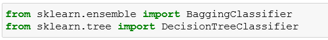
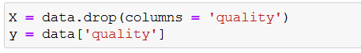
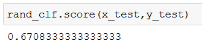
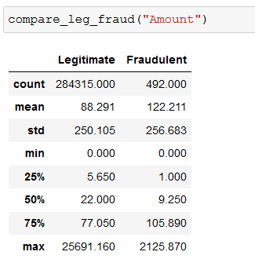
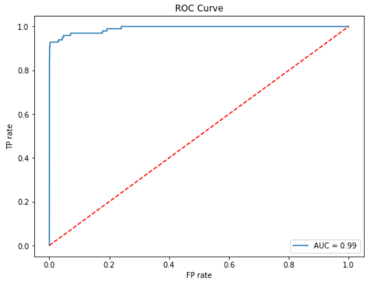

**Lab 4: Decision Trees and Ensemble Learning**

In the previous lab, we studied what Unsupervised Learning is, K-Means Clustering, Hierarchical Clustering, and Principal Component Analysis. In this lab, we will study what is decision tree, what are ensemble learning techniques and gradient boosting.

Let’s start our lab with decision trees.


#### Pre-reqs:
- Google Chrome (Recommended)

#### Lab Environment
Notebooks are ready to run. All packages have been installed. There is no requirement to install any packages. 


**Note:** Run following commands in the terminal to install graphviz (only required for https://mybinder.org/)

```
pip install imblearn
pip install scikit-learn==0.23.2
sudo apt-get update
sudo apt-get install -y graphviz
```


All examples are present in `~/work/machine-learning-essentials-module2/lab_4` folder. 


#### Decision Trees

**Exercise**

We will use the Sklearn module to implement a decision tree algorithm. Sklearn uses the CART (Classification and Regression Trees) algorithm and by default, it uses Gini impurity as a criterion to split the nodes.

There are other algorithms like ID3, C4.5, Chi-Square, etc.

We will see the use of CART in the following implementation


The data set consists following input variables: 1 – fixed acidity 2 - volatile acidity 3 - citric acid 4 - residual sugar 5 - chlorides 6 - free sulfur dioxide 7 - total sulfur dioxide 8 - density 9 - pH 10 - sulphates 11 – alcohol and the Output variable gives the quality of the wine based on the input variables: 12 - quality (score between 0 and 10)


We can see there is no missing data in the columns. Great!

Let’s split and fit the data without any pre-processing


Let’s see the performance of the model


The train score is 100%. Let’s see the test score


Let’s scale the data and check the model performance


We can see that around 95% of the variance is being explained by 8 components. So, instead of giving all columns as input in our algorithm let’s use these 8 principal components instead.


Let’s see how well our model performs on this new data. let's first visualize the tree on the data without doing any pre-processing


The performance of the model after PCA is 59%

Let’s do some hyper-parameter tuning. We are tuning three hyperparameters right now, we are passing the different values for both parameters.


Let’s check the best parameters from the grid search CV.


Let’s build the model with updated parameters.


The performance score after the hyper-parameter tuning is 59%.


**Bagging (Bootstrap Aggregation)**

In real-life scenarios, we don’t have multiple different training sets on which we can train our model separately and in the end combine their result. Here, bootstrapping comes into the picture. Bootstrapping is a technique of sampling different sets of data from a given training set by using replacement. After bootstrapping the training dataset, we train the model on all the different sets and aggregate the result. This technique is known as Bootstrap Aggregation or Bagging.

**Exercise**

We are using the ‘breast\_cancer’ dataset to demonstrate the bagging. 

**Importing the libraries and data**




Let’s split the train and test dataset.


Now. Let’s create a ‘bagging classifier’ object with a decision tree classifier.


In Scikit-Learn, you can set oob\_score=True when creating a ‘BaggingClassifier’ to request an automatic oob evaluation after training. The following code demonstrates this. The resulting evaluation score is available through the oob\_score\_ variable:


According to this oob evaluation, this ‘BaggingClassifier’ is likely to achieve about 96% accuracy on the test set. Let’s verify this:


**Random Forests**

Random Forest should be used where accuracy is up utmost priority and interpretability is not very important. Also, the computational time is less expensive than the desired outcome.

**Exercise**

Let’s see the python implementation of Random Forest.

**Importing the necessary libraries and data**


**Train & Test Split**




Creating Random Forest object


Let’s fit the model with default parameters


Performance evaluation



The accuracy score of the random forest algorithm is 67% with default parameters.

Let’s do the hyperparameter tuning with grid searchcv and check the accuracy of the model


Let’s check the best parameters


We are going the build the model using the best parameters 


Let’s check the performance of the model.


The random forest classifier gave us 67% accuracy on the test data.


**Case Study**

**Credit Card Fraud Detection**

The dataset contains transactions made by credit cards in September 2013 by European cardholders. This dataset presents transactions that occurred in two days, where we have 492 frauds out of 284,807 transactions. The dataset is highly unbalanced, the positive class (frauds) account for 0.172% of all transactions.

It contains only numerical input variables which are the result of a PCA transformation. Unfortunately, due to confidentiality issues, we cannot provide the original features and more background information about the data. Features V1, V2, … V28 is the principal components obtained with PCA, the only features which have not been transformed with PCA are 'Time' and 'Amount'. Feature 'Time' contains the seconds elapsed between each transaction and the first transaction in the dataset. The feature 'Amount' is the transaction Amount, this feature can be used for example-dependant cost-sensitive learning. Feature 'Class' is the response variable, and it takes value 1 in case of fraud and 0 otherwise.

**Importing all the required libraries**


**Importing data**


If we look at the dimensions of the data frame we will notice that the data set contains 284,807 samples in total. It also appears that there are no missing values, however, as card transaction datasets usually contain mostly normal transactions and just a small fraction of fraudulent ones, our expectation is that the dataset will be highly unbalanced. We confirm this by checking the distribution of the target classes.


Fraudulent transactions are 0.17% of the complete dataset. As expected, the majority of the samples are legitimate transactions. Only 0.17% of the transactions are flagged as fraudulent. Let’s also look at the basic descriptive statistics for all attributes.


Inspecting the statistics above reveals that V1-V28 attributes are zero-cantered, but this is not the case for the other two input attributes Time and Amount.


We can also plot the histogram for all input attributes and make sure nothing unusual stands out.


There isn’t much we can do about the principal components, but it looks like the Amount and Time attributes deserve a more detailed inspection.

First of all, the basic statistics for Time suggest that this attribute is given as a timestamp(seconds). We can convert it to local date and extract the hours in an attempt to identify if the hour of the transaction is correlated with the possibility of a transaction being fraudulent.


It appears that the legitimate transactions plunge during the night and their rate increases with the start of the working day. In contrast, there is a peak of fraudulent transactions at around 2 am that looks unusual. In addition, the data for the fraudulent transactions looks more evenly spread. Let's write a simple function that will allow us to compare the basic statistics for a single attribute across the fraud/no-fraud classes.


The fraudulent transactions definitely have a higher standard deviation, however, given their relatively low number we can't be certain if this is a genuine pattern or just a statistical coincidence.

We now shift our attention to the transaction amount. Let's visualize the distribution of fraudulent vs legitimate transactions via histograms.


Let's also look at the basic statistics for the Amount attribute.



It looks like the mean transaction amount is higher for fraudulent transactions, although the overall amount is significantly lower in absolute terms. We can also look at the top 5 most frequent legitimate transactions.


versus the top 5 fraudulent transactions


We see that nearly 23% of all fraudulent transactions amount to 1.0, where the percentage for the same transaction amount in the legitimate set is closer to 5%. We also see a large number of 0-value transactions. which is probably the result of cardholder details verification transactions.


**Feature Engineering**

The first thing we'll do before we attempt any feature engineering is to create a holdout set. This is to prevent any information leakage into our test set.


We noticed during the exploratory analysis that the Amount column is not zero mean-centered. Let's fix this, and also center the Hour attribute, which we'll be using instead of Time.


Next, we drop the Time attribute as we will be using Hour instead.


Now let's split the independent and the class variables into separate data frames.


**Oversampling**


Now that the class imbalance has been resolved, we can move forward with the actual model training.
## **Model training** 
We will now train an XGBoost classifier, using the oversampled training set. First, we define a function that will perform a grid search for the optimal hyperparameters of the classifier. The highlights of the function are as follows:

We do a parameter search over the hyperparameters given in params

- The cross-validation strategy for each model uses 3 folds in a stratified KFold
- The metric the models in the search are evaluated on is the Area Under the Receiver Operating Characteristic Curve (ROC AUC)
- The function prints the parameters that yield the highest AUC score and returns the parameters of the best estimator as its output


As the training set is quite large, we limit the grid search to a sample of 5000 observations. After xgboost\_search goes through all possible estimators it will print the parameters used for the best performing one and will return an XGBClassifier object that we can use to check how well the model generalizes.

Note, that although we are using a relatively small subset of the training data, the search still needs to train over 1,600 models, and this will take a while


Now that we have the set of parameters that produces the highest score, we can use them to train a model on the complete oversampled training set.


**Model Evaluation**

We will use a ROC AUC curve for evaluating how well our model performs on the holdout set (X\_test, y\_test). To generate the ROC curve we calculate the true positive (TP) and false positive (FP) rates on the holdout set at various threshold levels.

We also show the Area Under the Curve (AUC) on the plot, as it is equal to the probability the model will rank a uniformly drawn random positive higher than a uniformly drawn random negative.




A standard approach for binary classification problems is to look at the probability produced by the model and classify the observation as class 0 if the probability is under 0.5, and class 1 if it is equal or over 0.5. In highly unbalanced datasets this interpretation could lead to poor predictions. Offsetting the threshold (threshold moving) is a standard technique for improving the predictions by finding an optimal interpretation of the probabilities produced by the classifier.

There is an extra factor that comes into play in fraud detection, which is that the cost of one type of misclassification is substantially higher than the other. In other words, classifying a legitimate transaction as fraud is inconvenient at best, but letting a fraudulent transaction slip through has more dire consequences. In this context, offsetting the threshold in a way that reduces the false negatives at the expense of false positives becomes a viable strategy.

Selecting the optimal threshold value can be performed in a number of ways. Looking at the ROC curve, we can intuitively see that the best performance (misclassification costs aside) would be yielded by the threshold that puts us in the top left section of the curve (i.e. TP rate is high, FP rate is low). With this criterion in mind, we can define a distance metric to the top left corner of the curve and find a threshold that minimizes it.


We can also manually inspect the confusion matrices at different threshold values.


Looking at the plot above, we can indeed confirm that T=0.9 gives the best interpretation. The false negatives and false positives are both low. Increasing the threshold further leads to missing more fraudulent transactions and reducing it lower almost doubles the number of false positives.


**SUMMARY**

In this lab, we looked at Decision Tree, ensemble learning techniques like bagging and boosting. We looked at a real-world credit card transaction dataset and demonstrated how machine learning can be used to automate the detection of fraudulent transactions.

The imbalance in the dataset can be addressed by using under/oversampling techniques, and the interpretation of the probabilities can be fine-tuned to produce a better balance between false alarms and missed fraudulent transactions. 

Finally, we have evaluated the performance of the model using the evaluation metrics like confusion matrix and ROC/AUC curves.


**Program Assignment**

Build an algorithm that can predict a fraudulent transaction based on transaction attributes, using the Fraud Detection business case.

Follow the below step by step approach:

- Data importing
- Data Exploring
- Data Cleaning
- Feature Engineering 
- Feature selection
- Handling class imbalance issue
- Model building
- Hyperparameter tuning
- Model evaluation
